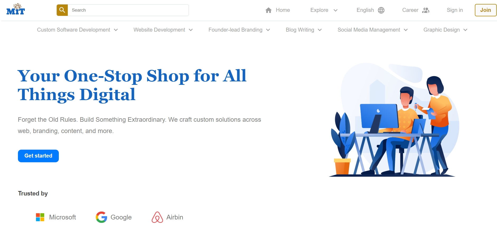
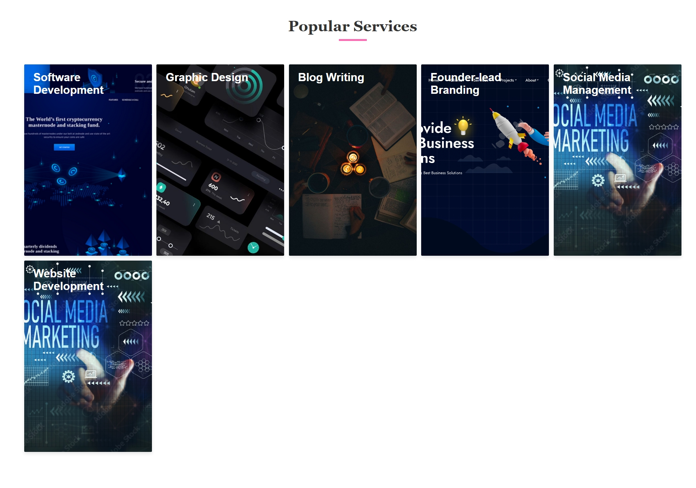
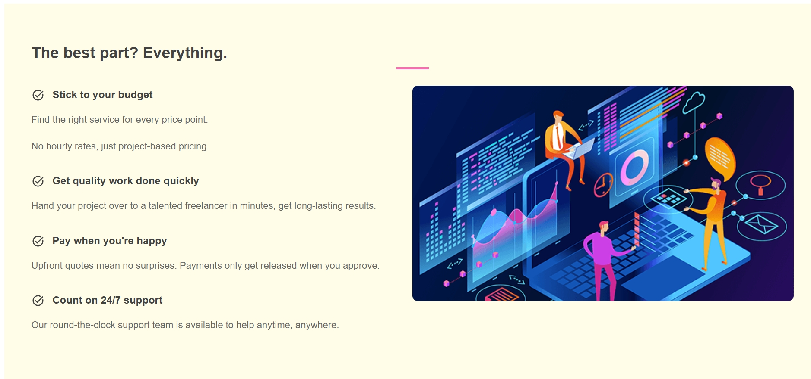
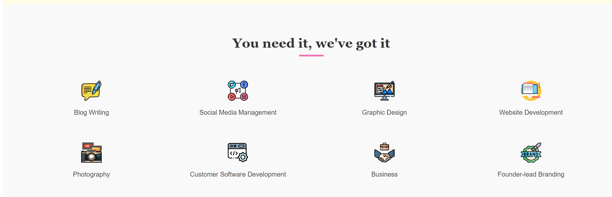
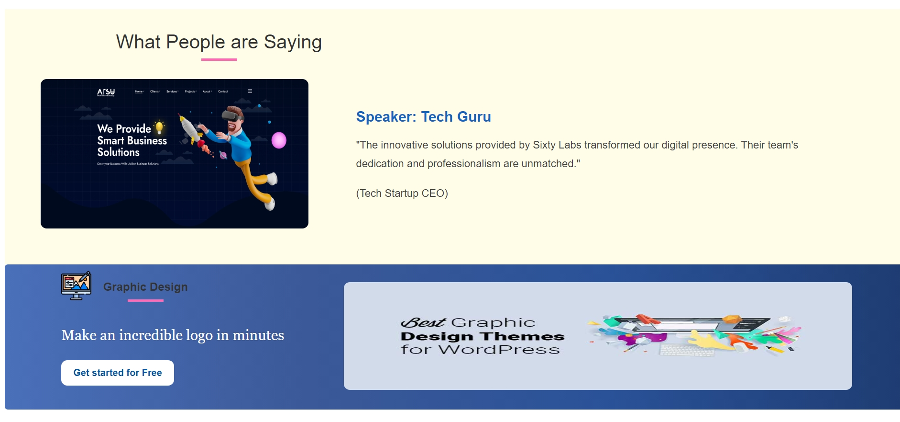
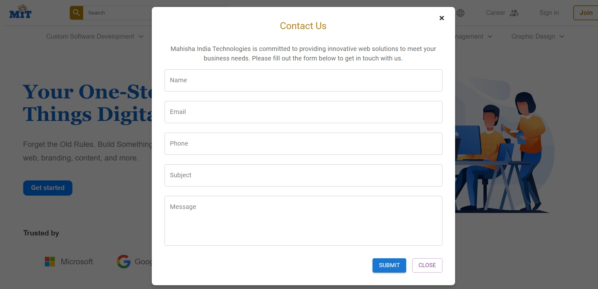

# 🚀 **Web Development Startup Company Website**

Welcome to the **Web Development Startup Website** repository! This project is a dynamic, modern website crafted for startups focusing on web development services. With a strong emphasis on both frontend aesthetics and backend functionality, this project demonstrates the power of modern web technologies.

---

## 🌟 **Project Overview**
This website serves as a digital portfolio and service showcase for a startup company specializing in **Website Development and Services**. It features a robust frontend interface combined with essential backend functionalities to ensure seamless user experiences.

---

## 🛠️ **Technologies Used**

### **Frontend:**
- **React** ⚛️
- **CSS** 🎨
- **MUI Styles** 🖌️
- **Node Packages:** (Slider, Typing Effect, and more)

### **Backend:**
- **Node.js** 🟢
- **Express.js** 🚀
- **MySQL** 🗄️ (Database)
- **Sequelize** 📊 (ORM for Database Management)
- **Nodemailer** 📧 (Contact Form Mail Service)

---

## 📐 **Project Highlights**
- **Dynamic Frontend:** Built with React and styled using CSS and MUI for a visually engaging user interface.
- **Interactive Elements:** Sliders, Typing Effects, and more Node-based functionalities.
- **Backend Integration:** Powered by Node.js and Express.js for handling API calls and server-side operations.
- **Database Management:** MySQL with Sequelize ORM for seamless data handling.
- **Contact Form Automation:** Automatic emails sent via Nodemailer upon form submissions.
- **Custom Design:** Fully developed without any pre-existing UI templates.

---

## 📸 **Project Screenshots**
Add screenshots of the website pages below to give viewers a visual preview of the project.

- **Homepage:** 
- **Page1:** 
- **Page2:** 
- **Page3:** 
- **Page4:** 
- **Page5:** 
- **Page6:** 


*Note: Replace `path-to-*` with your actual image paths.*

---

## 🧩 **Installation and Setup**

1. **Clone the Repository:**
   ```bash
   git clone https://github.com/yourusername/Startup_Website.git
   ```
2. **Navigate to the Project Folder:**
   ```bash
   cd Frontend & cd Backend
   ```
3. **Install Dependencies:**
   ```bash
   npm install
   ```
4. **Setup Database:**
   - Create a MySQL database.
   - Configure database credentials in `.env` file.
5. **Start the Development Server:**
   ```bash
   npm run dev
   ```
6. **Access the Website:**
   Open `http://localhost:5173` in your browser.

---

## 💡 **Key Features**
- Mobile-responsive design.
- Optimized performance.
- Secure backend integration.
- Real-time email notifications.

---

## 🤝 **Contributing**
Contributions are welcome! If you'd like to contribute, please fork the repository and create a pull request.

---

## 📬 **Contact**
If you have any questions or want to collaborate, feel free to reach out via email at `youremail@example.com`.

---


---

⭐ **Show some love by giving this project a star!** ⭐

Happy Coding! 🎉
